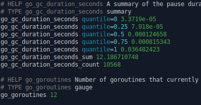

# promcurl

Colorize Prometheus metric output on the terminal.
|&nbsp;|&nbsp;|
|-|-|
| `promcurl -u http://prmths/metrics`    |  |
| `promcurl -u http://prmths/metrics -n` |  |

## Install

### Either download the binary ...

Precompiled amd64-binaries are available for Linux and MacOS: [Latest Release](https://github.com/danielb42/promcurl/releases/latest)

### ... or build it yourself

`go get github.com/danielb42/promcurl`
